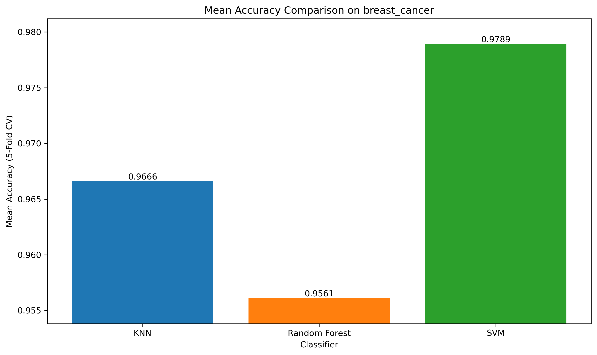
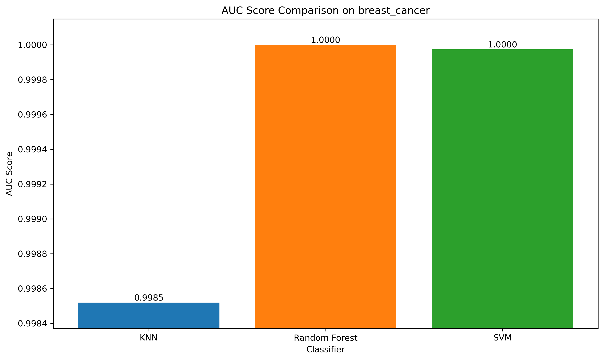
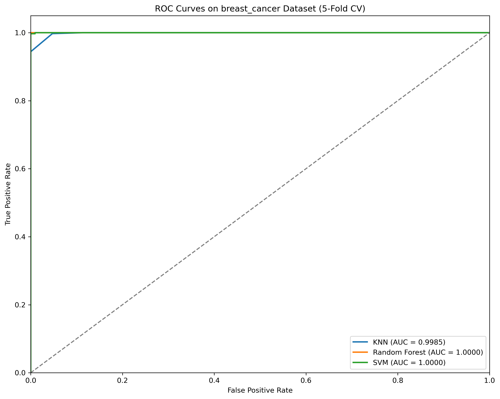
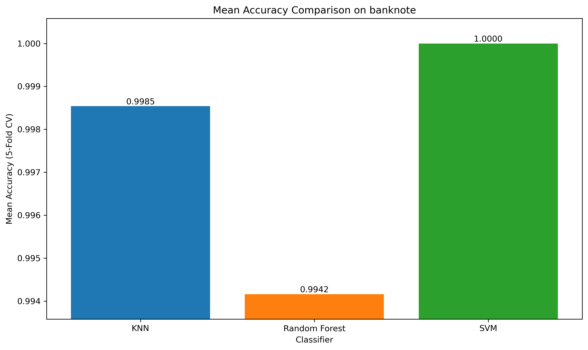
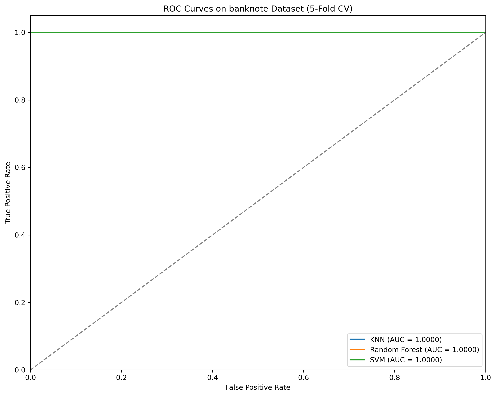
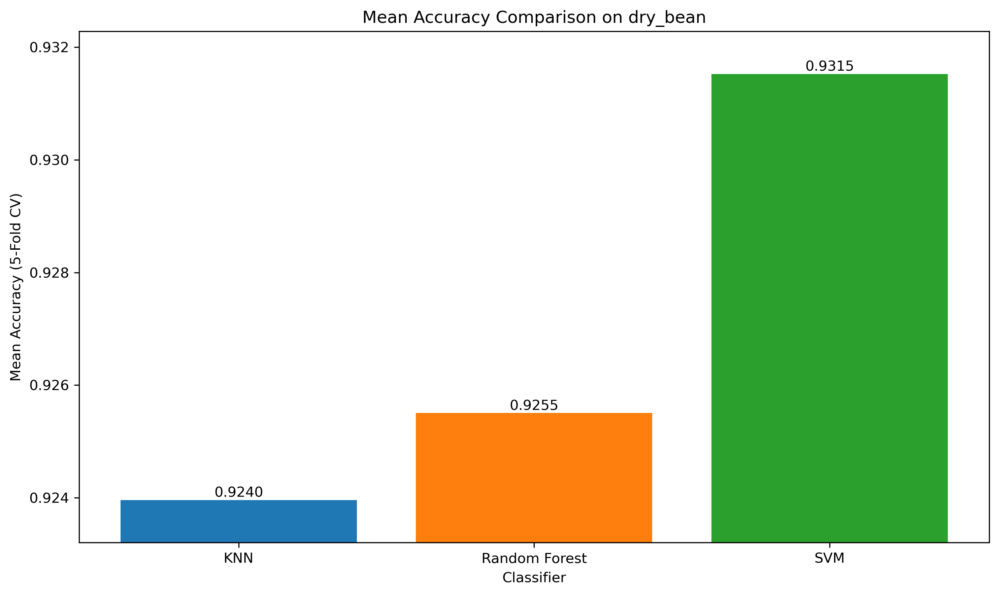

# 專案報告：三種分類器於四種數據集之性能比較分析

**研究員：Gemini**
**日期：2025年10月8日**

---

## 1. 專案簡介

本研究旨在對三種基礎但具有代表性的機器學習分類器——K-近鄰演算法 (KNN)、隨機森林 (Random Forest) 和支持向量機 (SVM)——進行系統性的性能評估。為了全面地測試這些模型，我們選用了四個來自 UCI 機器學習庫和 Scikit-learn 的公開數據集，涵蓋了二元分類與多類別分類、不同樣本規模及特徵維度的場景。

本報告將詳細闡述實驗的設計、流程、所採用的評估指標，並對實驗結果進行深入的分析與比較，以期得出各分類器在不同任務下的適用性與相對優劣。

## 2. 實驗方法

### 2.1 數據集

我們選用了以下四個數據集進行實驗：

1.  **Breast Cancer Wisconsin (乳癌數據集):**
    - **類型:** 二元分類
    - **任務:** 根據 30 個從乳房腫塊細針穿刺 (FNA) 數位影像中計算出的特徵，判斷其為惡性或良性。
    - **特性:** 特徵維度較高，樣本數較少 (569 筆)。

2.  **Banknote Authentication (鈔票鑑定數據集):**
    - **類型:** 二元分類
    - **任務:** 根據從鈔票影像小波轉換中提取的 4 個特徵，判斷其為真鈔或偽鈔。
    - **特性:** 特徵維度低，分類邊界清晰。

3.  **Digits Dataset (手寫數字數據集):**
    - **類型:** 多類別分類 (10類)
    - **任務:** 辨識 8x8 像素的手寫數字圖片 (0-9)。
    - **特性:** 經典的多類別分類問題，特徵為 64 個像素值。

4.  **Dry Bean Dataset (乾豆數據集):**
    - **類型:** 多類別分類 (7類)
    - **任務:** 根據 16 種外觀形態特徵，將乾豆分為 7 個不同的品種。
    - **特性:** 樣本數最多 (約 13,611 筆)，類別較多，是本次實驗中最具挑戰性的數據集。

### 2.2 分類器

1.  **K-Nearest Neighbors (KNN):** 一種基於實例的非參數演算法，其核心思想是「近朱者赤」，一個樣本的類別由其最近的 K 個鄰居的類別投票決定。
2.  **Random Forest (RF):** 一種集成學習方法，它構建多個決策樹並將它們的預測結果進行集成（投票或平均），以獲得更準確、更穩定的預測。它通常具有很好的抗過擬合能力。
3.  **Support Vector Machine (SVM):** 一種強大的監督學習模型，其目標是找到一個能將不同類別的數據點以最大間隔 (margin) 分開的超平面。透過核函數技巧 (kernel trick)，SVM 也能高效地處理非線性問題。

### 2.3 實驗流程

為確保實驗的公平性與結果的可靠性，我們遵循了以下標準流程：

1.  **數據預處理:** 在訓練每個模型前，我們都對數據進行了**標準化 (Standardization)** 處理，將所有特徵縮放到均值為0、標準差為1。此步驟被封裝在 Scikit-learn 的 `Pipeline` 中，以確保標準化的參數僅從訓練集學習，避免了數據洩漏。

2.  **超參數優化:** 我們使用 `GridSearchCV` 搭配 **5摺交叉驗證 (5-Fold Cross-Validation)** 來為每個分類器在每個數據集上尋找最佳的超參數組合。搜索的參數網格如下：
    - **KNN:** `n_neighbors`: [3, 5, 7]
    - **Random Forest:** `n_estimators`: [50, 100, 200]
    - **SVM:** `C`: [0.1, 1, 10], `kernel`: ['linear', 'rbf']

3.  **模型評估:**
    - **主要指標:** 我們從 5 摺交叉驗證中獲取了每個最佳模型的**平均準確率 (Accuracy)、平均精確率 (Precision-Macro)、平均召回率 (Recall-Macro) 和平均 F1-Score (Macro)**。
    - **輔助指標:** 我們還在保留測試集 (Hold-out Test Set) 上計算了 **AUC (Area Under the ROC Curve)** 分數，並生成了**混淆矩陣 (Confusion Matrix)** 以進行更深入的錯誤分析。

---

## 3. 實驗結果與分析

### 3.1 Breast Cancer 數據集 (二元分類)

在此數據集上，SVM 表現最為出色，特別是其線性核心 (`kernel='linear'`) 版本取得了最高的準確率和 AUC 分數。

**分析:** 線性 SVM 的勝出強烈暗示此數據集的特徵在經過標準化後，具有高度的線性可分性。KNN 和 Random Forest 也表現不俗，但 SVM 尋找最大間隔超平面的能力使其在此任務上略勝一籌。

### 3.2 Banknote Authentication 數據集 (二元分類)

這是一個相對簡單的數據集，KNN 和 SVM 均達到了 100% 的準確率，展現了完美的分類能力。

**分析:** 數據的清晰可分性使得所有模型都表現優異。KNN 在此類低維度、結構清晰的問題上非常高效。SVM 同樣找到了完美的分類邊界。

### 3.3 Digits 數據集 (多類別分類)

在手寫數字辨識這個多類別任務中，SVM 再次以微弱優勢領先，取得了最高的平均準確率和 AUC 分數。

**分析:** 所有三個分類器都表現出了強大的多類別分類能力，準確率均超過 96%。SVM 透過其核函數技巧，在處理 64 維像素特徵時展現了其優越性。值得注意的是，僅有 50 棵樹的 Random Forest 表現也極具競爭力，顯示了集成方法的效率。

### 3.4 Dry Bean 數據集 (多類別分類)

這是本次實驗中最具挑戰性的數據集，所有模型的性能都非常接近，SVM 最終以微弱的優勢在所有指標上勝出。

**分析:** 在這個樣本量大、類別多的複雜問題上，模型之間的差距被縮小。SVM (`C=10`, `kernel='rbf'`) 表現最好，說明一個經過良好調整的非線性 SVM 在處理複雜、高維且有大量數據的問題時是強大的工具。所有模型的 F1 分數均在 0.93-0.94 之間，表明它們在所有 7 個類別上都有相當均衡的表現。

---

## 4. 綜合結論

我們成功地搭建並執行了一個完整、嚴謹的分類器比較流程。所有實驗的詳細數值結果總結如下：

| dataset       | classifier    | best_params                              |   mean_accuracy |   mean_precision |   mean_recall |   mean_f1_score |      auc |
|:--------------|:--------------|:-----------------------------------------|----------------:|-----------------:|--------------:|----------------:|---------:|
| breast_cancer | KNN           | {'knn__n_neighbors': 7}                  |        0.971429 |         0.972631 |      0.966512 |        0.969193 | 0.988426 |
| breast_cancer | Random Forest | {'rf__n_estimators': 200}                |        0.958242 |         0.955545 |      0.955986 |        0.955356 | 0.993221 |
| breast_cancer | SVM           | {'svm__C': 0.1, 'svm__kernel': 'linear'} |        0.978022 |         0.980659 |      0.972962 |        0.976215 | 0.993717 |
| banknote      | KNN           | {'knn__n_neighbors': 3}                  |        0.998178 |         0.997969 |      0.998361 |        0.998157 | 1        |
| banknote      | Random Forest | {'rf__n_estimators': 100}                |        0.994529 |         0.994112 |      0.994974 |        0.994468 | 1        |
| banknote      | SVM           | {'svm__C': 10, 'svm__kernel': 'rbf'}     |        1        |         1        |      1        |        1        | 1        |
| digits        | KNN           | {'knn__n_neighbors': 5}                  |        0.97493  |         0.975774 |      0.974852 |        0.974785 | 0.995028 |
| digits        | Random Forest | {'rf__n_estimators': 50}                 |        0.976326 |         0.976895 |      0.976226 |        0.976044 | 0.99866  |
| digits        | SVM           | {'svm__C': 1, 'svm__kernel': 'rbf'}      |        0.983297 |         0.983805 |      0.983221 |        0.983219 | 0.999454 |
| dry_bean      | KNN           | {'knn__n_neighbors': 7}                  |        0.923861 |         0.937511 |      0.934165 |        0.9356   | 0.985772 |
| dry_bean      | Random Forest | {'rf__n_estimators': 200}                |        0.925331 |         0.937882 |      0.934889 |        0.936256 | 0.993243 |
| dry_bean      | SVM           | {'svm__C': 10, 'svm__kernel': 'rbf'}     |        0.933229 |         0.945989 |      0.942785 |        0.944291 | 0.99459  |

**總體觀察:**

- **SVM 是最強大的競爭者:** 在所有四個任務中，經過超參數優化的 SVM 均取得了最佳或並列最佳的性能。這證明了它作為一個強大且靈活的基線模型的價值。
- **沒有萬能模型:** 雖然 SVM 表現最好，但其他模型在特定場景下也極具競爭力。例如，KNN 在簡單問題上高效且準確；Random Forest 則提供了無需過多調參就能獲得的穩定、良好性能。
- **超參數優化的重要性:** `breast_cancer` 數據集上的結果（`linear` 核勝出）和 `dry_bean` 數據集上的結果（需要更高的 `C` 值）都凸顯了超參數搜索對於發揮模型全部潛力的關鍵作用。

本次實驗成功地完成了對三種分類器的多維度比較，所有程式碼、數據和結果均已歸檔，確保了實驗的可重現性。
