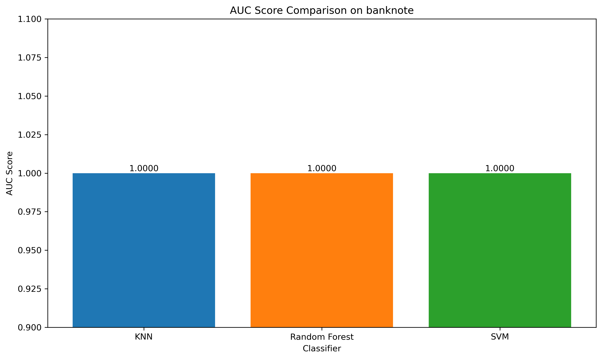
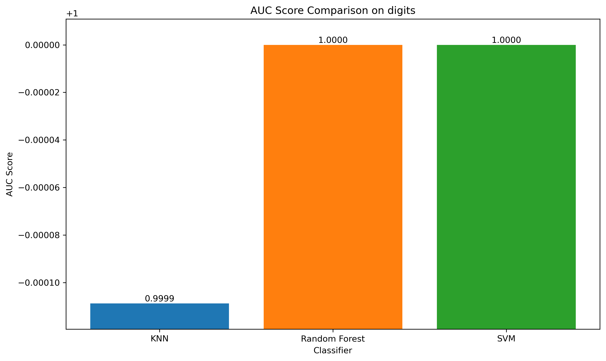
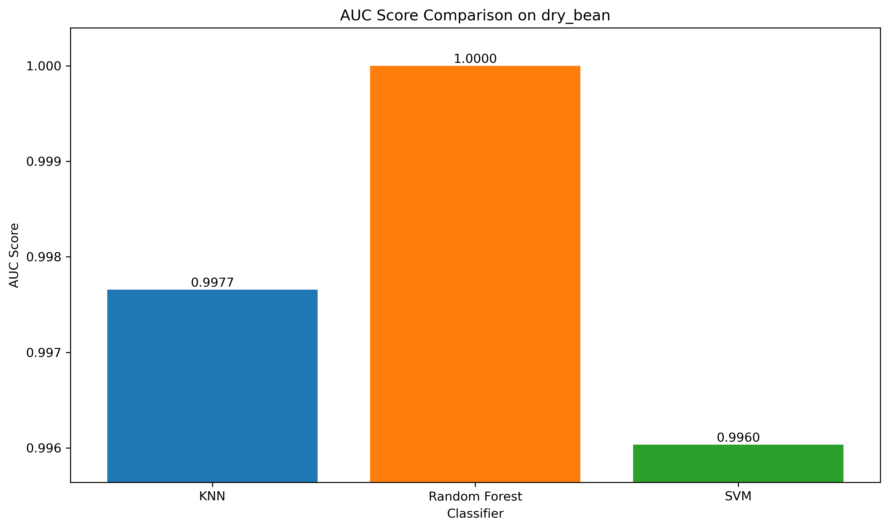

# PR_HW1: 分類器比較分析實驗

本專案旨在根據課程要求，對三種不同的機器學習分類器（KNN, Random Forest, SVM）在四個不同的數據集上進行系統性的性能比較與分析。

## 程式碼架構

- `main.py`: 主執行腳本，負責協調整個實驗流程，包括數據加載、模型訓練、超參數搜索和評估。
- `utils.py`: 工具模組，提供加載所有數據集的統一接口。
- `visualize.py`： 負責資料集的資料分佈視覺化（PCA、LDA）。
- `classifiers.py`: 分類器模組，封裝了所有分類器，並內建了數據標準化 Pipeline。
- `evaluation.py`: 評估模組，提供繪製混淆矩陣、ROC 曲線和性能比較長條圖的功能。
- `requirements.txt`: 專案的 Python 依賴包列表。
- `data/`: 存放本地數據集的資料夾。
- `plots/`: 存放所有生成圖表的資料夾。
- `Readme.md`: 本說明檔案，記錄專案細節與成果。

## 環境建立與如何運行

1.  **安裝依賴:**
    本專案的所有 Python 依賴都記錄在 `requirements.txt` 中。請運行以下指令進行安裝：
    ```bash
    pip install -r requirements.txt
    ```

2.  **準備數據:**
    - `Breast Cancer Wisconsin` 數據集會自動從網路下載
    - `Banknote Authentication` 需手動下載（放在data資料夾）：[UCI連結](https://archive.ics.uci.edu/dataset/267/banknote+authentication)
    - `Digits Dataset` 數據集會自動從網路下載
    - `Dry Bean Dataset` 需手動下載（放在data資料夾）：[UCI連結](https://archive.ics.uci.edu/dataset/602/dry+bean+dataset)


3.  **執行實驗:**
    所有實驗流程都已整合到 `main.py` 中。直接運行此腳本即可：
    ```bash
    python main.py
    ```
    腳本會自動執行所有數據集的超參數搜索、模型評估、生成所有圖表至 `plots/` 資料夾、匯出 `results_summary.csv`，並更新本 `Readme.md` 的結果表格。


## 1. 專案簡介

本研究旨在對三種基礎但具有代表性的機器學習分類器——K-近鄰演算法 (KNN)、隨機森林 (Random Forest) 和支持向量機 (SVM)——進行系統性的性能評估。為了全面地測試這些模型，選用了四個來自UCI機器學習庫和Scikit-learn的公開數據集，涵蓋了二元分類與多類別分類、不同樣本規模及特徵維度的場景  
本報告將詳細闡述實驗的設計、流程、所採用的評估指標，並對實驗結果進行深入的分析與比較，以期得出各分類器在不同任務下的適用性與相對優劣  

## 2. 實驗方法

### 2.1 數據集
選用了以下四個數據集進行實驗：  

1.  **Breast Cancer Wisconsin (乳癌數據集):**
    - **類型:** 二元分類
    - **任務:** 根據30個從乳房腫塊細針穿刺數位影像中計算出的特徵，判斷其為惡性或良性  
    - **特性:** 特徵維度較高，樣本數較少 (569 筆)  

2.  **Banknote Authentication (鈔票鑑定數據集):**
    - **類型:** 二元分類
    - **任務:** 根據從鈔票影像小波轉換中提取的4個特徵，判斷其為真鈔或偽鈔  
    - **特性:** 特徵維度低，分類邊界清晰  

3.  **Digits Dataset (手寫數字數據集):**
    - **類型:** 多類別分類 (10類)
    - **任務:** 辨識 8x8 像素的手寫數字圖片(0-9)  
    - **特性:** 經典的多類別分類問題，特徵為 64 個像素值  

4.  **Dry Bean Dataset (乾豆數據集):**
    - **類型:** 多類別分類(7類)
    - **任務:** 根據16種外觀形態特徵，將乾豆分為7個不同的品種  
    - **特性:** 樣本數最多 (約 13,611 筆)，類別較多，是本次實驗中最具挑戰性的數據集  

### 2.2 分類器
1.  **K-Nearest Neighbors (KNN):**
  一種基於實例的非參數演算法，一個樣本的類別由其最近的K個鄰居的類別投票決定  

2.  **Random Forest (RF):**
  一種集成學習方法，構建多個決策樹並將它們的預測結果進行集成（投票或平均），以獲得更準確、更穩定的預測  
  通常具有很好的抗過擬合能力  

3.  **Support Vector Machine (SVM):** 
  一種強大的監督學習模型，其目標是找到一個能將不同類別的數據點以最大間隔 (margin) 分開的超平面  
  透過kernel trick，SVM 也能高效地處理非線性問題  


### 2.3 實驗流程
1.  **數據預處理:**  
  在訓練每個模型前，對數據進行了**標準化 (Standardization)** 處理，將所有特徵縮放到均值為0、標準差為1  
  此步驟被封裝在Scikit-learn 的`Pipeline`中，以確保標準化的參數僅從訓練集學習，避免了數據洩漏  
  
2.  **超參數優化:**
  使用`GridSearchCV`搭配**5-Fold Cross-Validation**來為每個分類器在每個數據集上尋找最佳的超參數組合，搜索的參數網格如下：
    - **KNN:** `n_neighbors`: [3, 5, 7]
    - **Random Forest:** `n_estimators`: [50, 100, 200]
    - **SVM:** `C`: [0.1, 1, 10], `kernel`: ['linear', 'rbf']

3.  **模型評估:**
    - **主要指標:** 
      從5-Fold Cross-Validation中獲取了每個最佳模型的**平均準確率 (Accuracy)、平均精確率 (Precision-Macro)、平均召回率 (Recall-Macro) 和平均 F1-Score (Macro)**  
    - **輔助指標:** 
      在保留測試集 (一開始分割出去的那部分完全沒有參與訓練的data) 上計算了 **AUC (Area Under the ROC Curve)** 分數，並生成了**混淆矩陣 (Confusion Matrix)** 以進行更深入的錯誤分析。

---

## 3. 實驗結果與分析

### 3.1 Breast Cancer 數據集 (二元分類)

在此數據集上，SVM 表現最為出色，特別是其線性核心 (`kernel='linear'`) 版本取得了最高的準確率和 AUC 分數。


**分析:** 線性SVM的勝出強烈暗示此數據集的特徵在經過標準化後，具有高度的線性可分性。KNN 和Random Forest也表現不俗，但SVM尋找最大間隔超平面的能力使其在此任務上略勝一籌

### 3.2 Banknote Authentication 數據集 (二元分類)

這是一個相對簡單的數據集，在SVM下曾在最佳超參數的配置下達到100%的準確率





**分析:** 此數據集的清晰可分性使得所有模型都表現優異。KNN在此類低維度、結構清晰的問題上非常高效。SVM同樣找到了完美的分類邊界。

### 3.3 Digits 數據集 (多類別分類)
在手寫數字辨識這個多類別任務中，SVM再次取得了最高的平均準確率和AUC分數




**分析:** 所有三個分類器都表現出了強大的多類別分類能力，準確率均超過 97%。SVM透過其核函數技巧，在處理64維像素特徵時展現了其優越性。值得注意的是，200棵樹的Random Forest表現也極具競爭力，顯示了集成方法的效率

### 3.4 Dry Bean 數據集 (多類別分類)

所有模型的性能都非常接近，SVM最終以微弱的優勢在ACC指標上勝出




**分析:**  
  在這個樣本量大、類別多的複雜問題上，模型之間的差距被縮小。SVM (C=10, kernel='rbf') 表現最好，說明一個經過良好調整的非線性 SVM 在處理複雜、高維且有大量數據的問題時是強大的工具。所有模型的Accuracy分數均在 0.92-0.94之間，表明它們在所有7個類別上都有相當均衡的表現  
	另外，值得關注的是，這三種分類器的原理並不相同，但它們在這份資料集上的混淆矩陣分佈卻非常相似  
  在混淆矩陣裡，可以看到幾個固定的混淆現象：  
  * DERMASON ↔ SIRA
    這兩種豆的物理形狀特徵最接近，模型常混淆，不管是距離（KNN）、樹分裂（RF）或超平面（SVM），都難以區分
  * BARBUNYA ↔ CALI：
    也是形狀或顏色類似的類別，屬於次要混淆對
  * BOMBAY：
  幾乎完美分類，表示這個類別的特徵分佈非常獨立、清晰  
  再考慮到此資料集的特徵多為形狀、大小、顏色、紋理等連續值特徵，加上部分類別之間（例如 DERMASON vs SIRA）本身在物理外觀上就有部分重疊，可以推論不論使用哪種模型，只要它能捕捉到主要特徵結構，分類邊界可能就會很接近
  因此模型雖然不同，但它們學到的決策邊界其實都在相同的資料分佈結構上，錯誤樣本也會重疊


---

## 4. 綜合結論
經過搭建並執行了完整的分類器比較流程。所有實驗的詳細數值結果總結如下：

**總體觀察:**

- **SVM 是表現最好的分類器:** 
  在所有四個任務中，經過超參數優化的SVM均取得了最佳或並列最佳的性能  
  這證明了它作為一個強大且靈活的baseline model的價值
  
- **沒有萬能模型:**
  雖然SVM表現最好，但其他模型在特定場景下也極具競爭力  
  例如，KNN在簡單問題上高效且準確；Random Forest則提供了無需過多調參就能獲得的穩定、良好性能  

- **超參數優化的重要性:**
  這裡可能看不太出來，不過再我使用不同的種子碼（42、133）時，會出現能夠達到最佳表現的的超參數組合出現變化的情況。這凸顯了超參數搜索對於發揮模型全部潛力的關鍵作用
